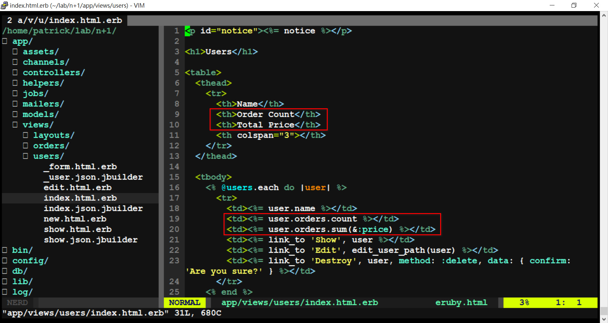
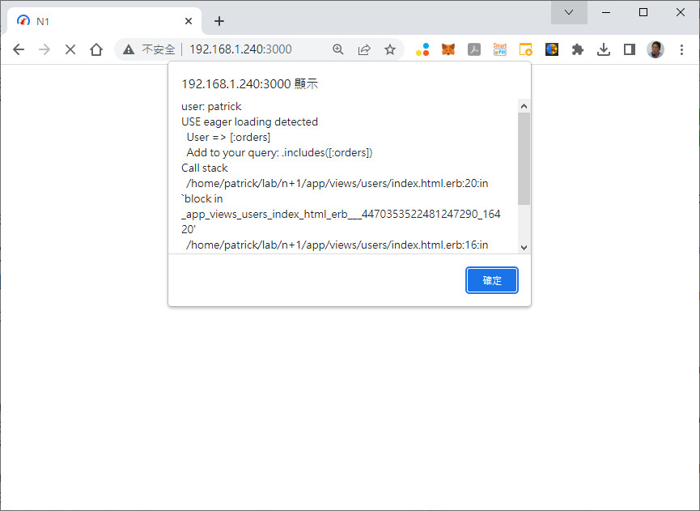
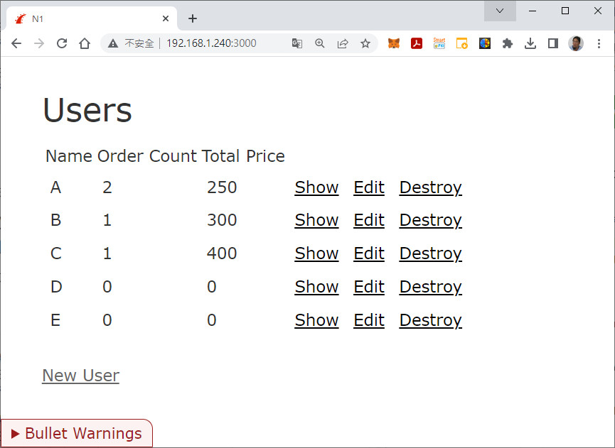
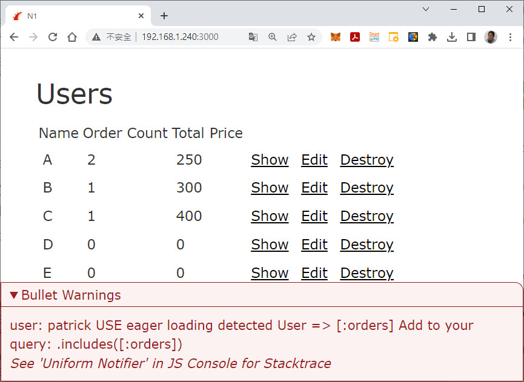
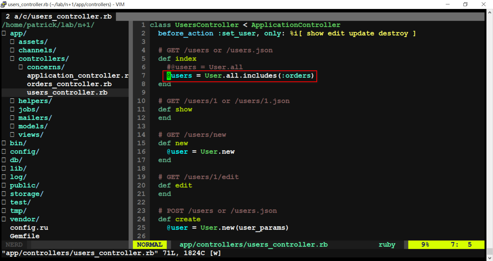
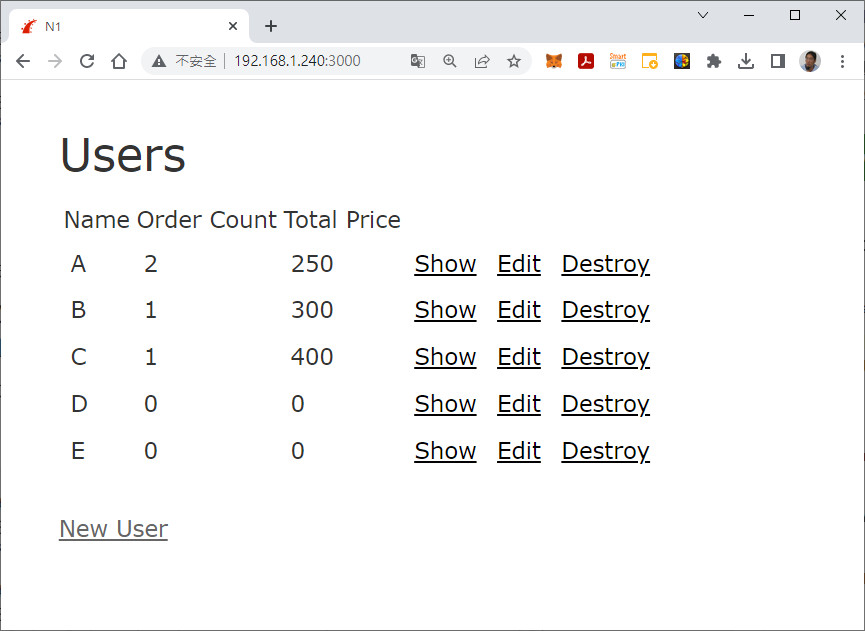

# ●Bullet (檢查N+1查詢)


## 1. 配置

```ruby
$ rails _5.2.8.1_ new n+1

$ cd n+1

$ rails db:migrate

$ rails g scaffold User name

$ rails g scaffold Order item price:integer user:references

vi app/models/order.rb  #新增 belongs_to :user
vi app/models/user.rb   #新增 has_many :orders
```


## 2. 部屬 Bullet

```ruby
$ vi Gemfile  #在 gem 'rails' 後加入 gem 'bullet', group: 'development'

$ bundle

$ rails g bullet:install
```


## 3. 修改

```ruby
vi app/views/users/index.html.erb  #加入
========================================
 <td><%= user.orders.count %></td>
 <td><%= user.orders.sum(&:price) %></td>
========================================
```



## 4. 測試

```ruby
$ rails s -b 0.0.0.0

打開瀏覽器 http://localhost:3000
```

* 修正前 => `@user = User.all`









* 修正後 => `@user = User.all.includes(:orders)`



---
= END =